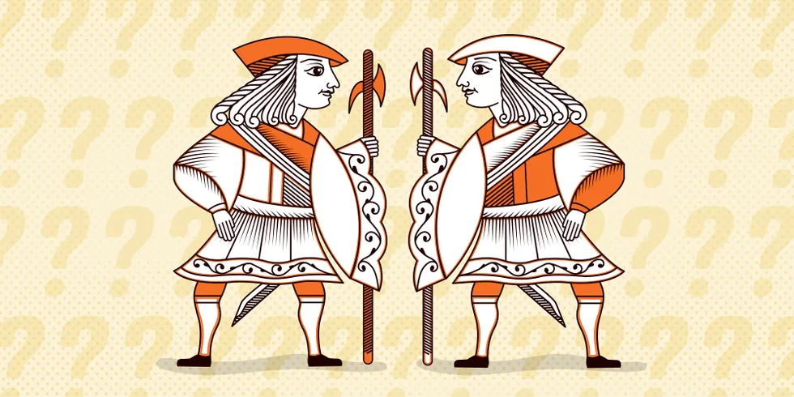
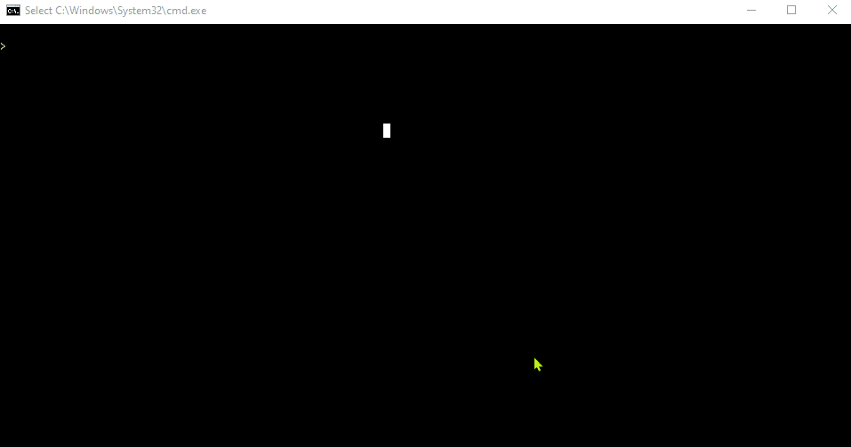

# Knights and Knaves

|  |
| :-- |
|  Picture by Michael Stillwell on Pinterest  |

It is a project that tries to solve logical puzzles termed as "Knights and Knaves" by logician Raymond Smullyan in 1978[^1]. In such a puzzle, each character is either knight or knave. A __knight always tells the truth and a knave always lies__. The objective of the puzzle is, given a set of sentences spoken by each of the characters, determine whether that character is a knight or knave.

# Code in Action

Here we can see the final result of the implementation. It solves the following puzzles:

## Puzzle 0

It contains a single character A.

* A says "I am both a knight and a knave."

## Puzzle 1

Has two characters A and B.

* A says "We are both knaves."
* B says nothing.

## Puzzle 2

Has two characters A and B.

* A says "We are the same kind."
* B says "We are of different kinds."

## Puzzle 3

Has three characters A, B and C.

* A says either "I am a knight." or "I am a knave.", but you don't know which.
* B says "A said 'I am a knave.'"
* B then says "C is a knave."
* C says "A is a knight."

[^1]: [Knights and Knaves](https://en.wikipedia.org/wiki/Knights_and_Knaves)
